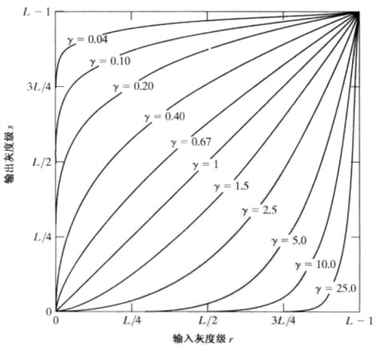
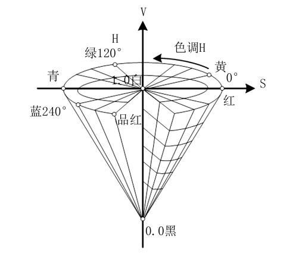
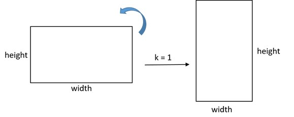
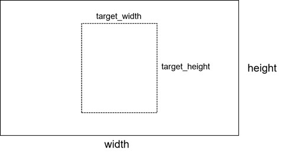
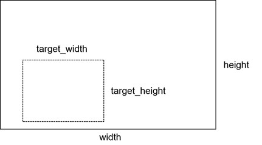
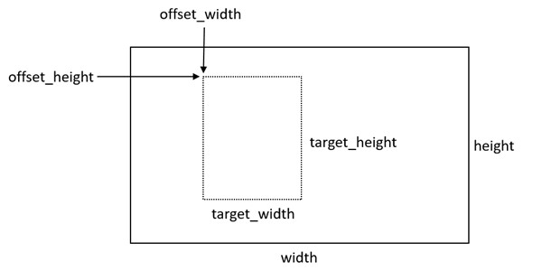
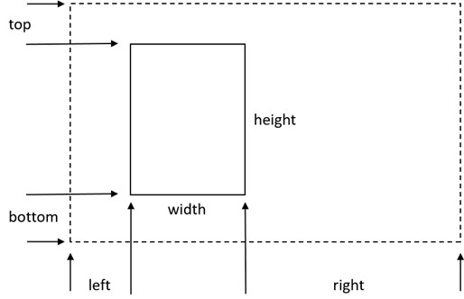
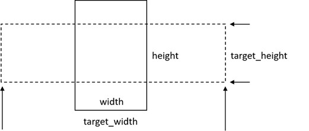

# 图像处理算子接口
## 6.1 接口列表
| 类别             | 名称                                                                                                       |
| ---------------- | ---------------------------------------------------------------------------------------------------------- |
| 图像参数调整     | 图像亮度调整、图像对比度调整、图像伽马变换（幂律变换）、图像色调调整、图像饱和度调整，以及部分随机调整操作 |
| 图像颜色空间转换 | 图像在RGB、HSV、YUV、YIQ、灰度等颜色空间（色域）之间的转换操作，图像数据类型转换                           |
| 图像翻转和转置   | 图像水平翻转、图像垂直翻转、图像转置、图像旋转                                                             |
| 图像裁剪和缩放   | 图像中心裁剪、图像随机裁剪、图像填充、图像缩放                                                             |
| 其他图像操作     | 图像高斯模糊、图像归一化、图像梯度计算                                                                     |

## 6.2 接口功能和参数

-------------
### 6.2.1 调整图像亮度
#### 6.2.1.1 功能描述
提供接口，将输入的待调整图像转换成浮点数表示，根据参数brightness_factor对图像的亮度进行调整，之后再将其转回原先的数据类型。  
具体调整方式是，将brightness_factor累加到输入图像的每个像素上，超过表示范围的用clip操作进行截断处理。

$$Out[i]=Clip(In[i]+brightness\underline{ }factor)$$

#### 6.2.1.2 接口参数
| 参数名       | 参数类型 | 可选/必选 | 参数说明                                                                                                                       |
| ------------ | -------- | --------- | ------------------------------------------------------------------------------------------------------------------------------ |
| 待调整图像   | 输入     | 必选      | 输入的待调整图像，维度大小为3维（height, width, channel）或4维（含batch_size）。元素类型可以为32位整数，32位浮点数，64位浮点数 |
| 亮度调整参数 | 输入     | 必选      | 亮度调整参数brightness_factor，标量，数据类型为32位浮点数，64位浮点数。                                                        |
| 调整后的图像 | 输出     | 必选      | 输出的调整亮度后的图像，数据类型、维度信息与输入相同                                                                           |

#### 6.2.1.3 接口返回值
没有错误：操作成功。  
类型不匹配：各参数与要求类型不一致。  
非法参数：参数设置超过合法范围，例如brightness_factor＞1。  
#### 6.2.1.4 引用说明
接口设计参考了TensorFlow、PyTorch、MindSpore、飞桨的接口。
#### 6.2.1.5 其他附加说明
接口会对调整明暗度后溢出原本表示范围的像素值进行clip截断处理。

<h4><a href="../../C%E6%8E%A5%E5%8F%A3%E7%A4%BA%E4%BE%8B/%E5%9B%BE%E5%83%8F%E7%AE%97%E5%AD%90C%E6%8E%A5%E5%8F%A3%E7%A4%BA%E4%BE%8B.md#user-content-701">6.2.1.6 接口示例</a></h4>

--------------

### 6.2.2 调整图像对比度
#### 6.2.2.1 功能描述
提供接口，将输入的待调整图像转换成浮点数表示，根据参数contrast_factor对图像的对比度进行调整，之后再将其转回原先的数据类型。  
对比度调整的方式为，针对输入图像的每个像素值，将其与整张图像均值之间的差缩放contrast_factor倍，得到输出图像。

$$Out[i]=(In[i]-mean)×contrast\underline{ }factor+In[i]$$

#### 6.2.2.2 接口参数
| 参数名         | 参数类型 | 可选/必选 | 参数说明                                                                                                                       |
| -------------- | -------- | --------- | ------------------------------------------------------------------------------------------------------------------------------ |
| 待调整图像     | 输入     | 必选      | 输入的待调整图像，维度大小为3维（height, width, channel）或4维（含batch_size）。元素类型可以为32位整数，32位浮点数，64位浮点数 |
| 对比度调整参数 | 输入     | 必选      | 对比度调整参数contrast_factor，标量，数据类型为32位浮点数，64位浮点数                                                          |
| 调整后的图像   | 输出     | 必选      | 输出的调整对比度后的图像，数据类型、维度信息与输入相同                                                                         |

#### 6.2.2.3 函数返回值
没有错误：操作成功。  
类型不匹配：各参数与要求类型不一致。  
非法参数：参数设置超过合法范围，例如contrast_factor＜0。
#### 6.2.2.4 引用说明
接口设计参考了TensorFlow、PyTorch、MindSpore、飞桨的接口。
#### 6.2.2.5 其他附加说明
算子接口在contrast_factor参数为0时输出纯灰色图像，在contrast_factor参数为1时输出原始图像。

<h4><a href="../../C%E6%8E%A5%E5%8F%A3%E7%A4%BA%E4%BE%8B/%E5%9B%BE%E5%83%8F%E7%AE%97%E5%AD%90C%E6%8E%A5%E5%8F%A3%E7%A4%BA%E4%BE%8B.md#user-content-702">6.2.2.6 接口示例</a></h4>

---------------

### 6.2.3 图像伽马变换（幂律变换）
#### 6.2.3.1 功能描述
提供接口，将输入的待调整图像转换成浮点数表示，之后根据输入的gamma参数，对图像进行伽马变换（幂律变换），随后将其转回原先的数据类型。

  

输入图像的各通道所做的变换如下公式所述：

$$Out[i]=gain×In[i]^{gamma}$$

#### 6.2.2.3 接口参数
| 参数名           | 参数类型 | 可选/必选 | 参数说明                                                                                                                       |
| ---------------- | -------- | --------- | ------------------------------------------------------------------------------------------------------------------------------ |
| 待调整图像       | 输入     | 必选      | 输入的待变换图像，维度大小为3维（height, width, channel）或4维（含batch_size）。元素类型可以为32位整数，32位浮点数，64位浮点数 |
| 伽马变换指数参数 | 输入     | 必选      | 伽马变换（幂律变换）参数gamma，标量，数据类型为32位浮点数，64位浮点数                                                          |
| 伽马变换乘子参数 | 输入     | 必选      | 伽马变换（幂律变换）参数gain，标量，数据类型为32位浮点数，64位浮点数                                                           |
| 调整后的图像     | 输出     | 必选      | 输出的伽马变换（幂律变换）后的图像，数据类型、维度信息与输入相同                                                               |

#### 6.2.3.3 函数返回值
没有错误：操作成功。  
类型不匹配：各参数与要求类型不一致。  
非法参数：参数设置超过合法范围，例如gamma＜0。

#### 6.2.3.4 引用说明
接口设计参考了TensorFlow、PyTorch、MindSpore、飞桨的接口。

<h4><a href="../../C%E6%8E%A5%E5%8F%A3%E7%A4%BA%E4%BE%8B/%E5%9B%BE%E5%83%8F%E7%AE%97%E5%AD%90C%E6%8E%A5%E5%8F%A3%E7%A4%BA%E4%BE%8B.md#user-content-703">6.2.3.5 接口示例</a></h4>

----------

### 6.2.4 调整图像色调
#### 6.2.4.1 功能描述
提供接口，将输入的待调整图像转换成HSV表示，根据参数hue_factor对图像的色调通道（hue channel）进行调整，之后再将其转回原先的图像表示类型。

  

如图所示，在图像的HSV空间对H分量进行旋转操作，即可实现图像色调的转换，hue_factor用于表示旋转的方向和度数。
#### 6.2.4.2 接口参数
| 参数名       | 参数类型 | 可选/必选 | 参数说明                                                                                                                       |
| ------------ | -------- | --------- | ------------------------------------------------------------------------------------------------------------------------------ |
| 待调整图像   | 输入     | 必选      | 输入的待调整图像，维度大小为3维（height, width, channel）或4维（含batch_size）。元素类型可以为32位整数，32位浮点数，64位浮点数 |
| 色调调整参数 | 输入     | 必选      | 色调调整参数hue_factor，标量，数据类型为32位浮点数，64位浮点数                                                                 |
| 调整后的图像 | 输出     | 必选      | 输出的调整色调后的图像，数据类型、维度信息与输入相同                                                                           |

#### 6.2.4.3 函数返回值
没有错误：操作成功。  
类型不匹配：各参数与要求类型不一致。  
非法参数：参数设置超过合法范围。

#### 6.2.4.4 引用说明
接口设计参考了TensorFlow、PyTorch、MindSpore、飞桨的接口。

#### 6.2.4.5 其他附加说明
算子接口在hue_factor参数为0时会输出原始图像。

<h4><a href="../../C%E6%8E%A5%E5%8F%A3%E7%A4%BA%E4%BE%8B/%E5%9B%BE%E5%83%8F%E7%AE%97%E5%AD%90C%E6%8E%A5%E5%8F%A3%E7%A4%BA%E4%BE%8B.md#user-content-704">6.2.4.6 接口示例</a></h4>

--------------

### 6.2.5 调整图像饱和度
#### 6.2.5.1 功能描述
提供接口，将输入的待调整图像转换成HSV表示，根据参数saturation_factor对图像的饱和度通道（saturation channel）进行调整，之后再将其转回原先的图像表示类型。  
调整方式为，对输入图像的每一个像素，与saturation_factor参数进行相乘，超出表示范围的用clip截断处理。

$$Out[i]=Clip(In[i]×saturation\underline{ }factor)$$

#### 6.2.5.2 接口参数
| 参数名         | 参数类型 | 可选/必选 | 参数说明                                                                                                                       |
| -------------- | -------- | --------- | ------------------------------------------------------------------------------------------------------------------------------ |
| 待调整图像     | 输入     | 必选      | 输入的待调整图像，维度大小为3维（height, width, channel）或4维（含batch_size）。元素类型可以为32位整数，32位浮点数，64位浮点数 |
| 饱和度调整参数 | 输入     | 必选      | 饱和度调整参数saturation_factor，标量，数据类型为32位浮点数，64位浮点数                                                        |
| 调整后的图像   | 输出     | 必选      | 输出的调整饱和度后的图像，数据类型、维度信息与输入相同                                                                         |

#### 6.2.5.3 函数返回值
没有错误：操作成功。  
类型不匹配：各参数与要求类型不一致。  
非法参数：参数设置超过合法范围，例如saturation_factor＜0。

#### 6.2.5.4 引用说明
接口设计参考了TensorFlow、PyTorch、MindSpore、飞桨的接口。

#### 6.2.5.5 其他附加说明
算子接口在saturation_factor参数为0时会输出黑白图像，在saturation_factor参数为1时会输出原始图像，经过饱和度调整后如果超出了原有图像类型的表示范围，会对超过范围的像素进行clip截断操作。

<h4><a href="../../C%E6%8E%A5%E5%8F%A3%E7%A4%BA%E4%BE%8B/%E5%9B%BE%E5%83%8F%E7%AE%97%E5%AD%90C%E6%8E%A5%E5%8F%A3%E7%A4%BA%E4%BE%8B.md#user-content-705">6.2.5.6 接口示例</a></h4>

--------------

### 6.2.6 随机调整图像亮度
#### 6.2.6.1 功能描述
提供接口，将输入的待调整图像转换成浮点数表示，在参数lower和upper给定的范围内随机选取参数brightness_factor对图像的亮度进行调整，之后再将其转回原先的数据类型。  
对于批量输入图像，每张图像的随机调整操作与其余图像的亮度调整互不影响。  
具体调整方式是，将选定的参数brightness_factor累加到输入图像的每个像素上，超过表示范围的用clip操作进行处理。

$$Out[i]=Clip(In[i]+brightness\underline{ }factor)$$

$$lower≤brightness\underline{ }factor≤upper$$

#### 6.2.6.2 接口参数
| 参数名       | 参数类型 | 可选/必选 | 参数说明                                                                                                                       |
| ------------ | -------- | --------- | ------------------------------------------------------------------------------------------------------------------------------ |
| 待调整图像   | 输入     | 必选      | 输入的待调整图像，维度大小为3维（height, width, channel）或4维（含batch_size）。元素类型可以为32位整数，32位浮点数，64位浮点数 |
| 参数下限     | 输入     | 可选      | 亮度调整参数brightness_factor的最小值，标量，数据类型为32位浮点数，64位浮点数，默认值为-1.0                                    |
| 参数上限     | 输入     | 可选      | 亮度调整参数brightness_factor的最大值，标量，数据类型为32位浮点数，64位浮点数，默认值为1.0                                     |
| 随机种子     | 输入     | 可选      | 数据类型为32位整数，用于生成随机种子                                                                                           |
| 调整后的图像 | 输出     | 必选      | 输出的调整亮度后的图像，数据类型、维度信息与输入相同                                                                           |

#### 6.2.6.3 函数返回值
没有错误：操作成功。  
类型不匹配：各参数与要求类型不一致。  
非法参数：参数设置超过合法范围，例如upper＞1或lower＞1。

#### 6.2.6.4 引用说明
接口设计参考了TensorFlow、PyTorch、MindSpore、飞桨的接口。

#### 6.2.6.5 其他附加说明
接口会对调整明暗度后溢出原本表示范围的像素值进行clip处理，此外参数下限和参数上限需要一同给定。

<h4><a href="../../C%E6%8E%A5%E5%8F%A3%E7%A4%BA%E4%BE%8B/%E5%9B%BE%E5%83%8F%E7%AE%97%E5%AD%90C%E6%8E%A5%E5%8F%A3%E7%A4%BA%E4%BE%8B.md#user-content-706">6.2.6.6 接口示例</a></h4>

--------------

### 6.2.7 随机调整图像对比度
#### 6.2.7.1 功能描述
提供接口，将输入的待调整图像转换成浮点数表示，在参数lower和upper给定的范围内随机选取参数contrast_factor对图像的对比度进行调整，之后再将其转回原先的数据类型。  
对于批量输入图像，每张图像的随机调整操作与其余图像的对比度调整互不影响。  
对比度调整的方式为，针对输入图像的每个像素值，将其与整张图像均值之间的差缩放contrast_factor倍，得到输出图像。

$$Out[i]=(In[i]-mean)×contrast\underline{ }factor+In[i]$$

$$lower≤contrast\underline{ }factor≤upper$$

#### 6.2.7.2 接口参数
| 参数名       | 参数类型 | 可选/必选 | 参数说明                                                                                                                       |
| ------------ | -------- | --------- | ------------------------------------------------------------------------------------------------------------------------------ |
| 待调整图像   | 输入     | 必选      | 输入的待调整图像，维度大小为3维（height, width, channel）或4维（含batch_size）。元素类型可以为32位整数，32位浮点数，64位浮点数 |
| 参数下限     | 输入     | 必选      | 对比度调整参数contrast_factor的最小值，标量，数据类型为32位浮点数，64位浮点数                                                  |
| 参数上限     | 输入     | 必选      | 对比度调整参数contrast_factor的最大值，标量，数据类型为32位浮点数，64位浮点数                                                  |
| 随机种子     | 输入     | 可选      | 数据类型为32位整数，用于生成随机种子                                                                                           |
| 调整后的图像 | 输出     | 必选      | 输出的调整对比度后的图像，数据类型、维度信息与输入相同                                                                         |

#### 6.2.7.3 函数返回值
没有错误：操作成功。  
类型不匹配：各参数与要求类型不一致。  
非法参数：参数设置超过合法范围，例如upper＞1或lower＞1。

#### 6.2.7.4 引用说明
接口设计参考了TensorFlow、PyTorch、MindSpore、飞桨的接口。

#### 6.2.7.5 其他附加说明
接口会对调整明暗度后溢出原本表示范围的像素值进行clip截断处理，upper和lower参数均应在0到1之间，且需保证lower＜upper。

<h4><a href="../../C%E6%8E%A5%E5%8F%A3%E7%A4%BA%E4%BE%8B/%E5%9B%BE%E5%83%8F%E7%AE%97%E5%AD%90C%E6%8E%A5%E5%8F%A3%E7%A4%BA%E4%BE%8B.md#user-content-707">6.2.7.6 接口示例</a></h4>

--------------

### 6.2.8 随机调整图像色调
#### 6.2.8.1 功能描述
提供接口，将输入的待调整图像转换成HSV表示，之后在参数lower和upper给定的范围内随机选取参数hue_factor对图像的色调通道（hue channel）进行调整，之后再将其转回原先的图像表示类型。  
对于批量输入图像，每张图像的随机调整操作与其余图像的色调调整互不影响。

  

如图所示，在图像的HSV空间对H分量进行旋转操作，即可实现图像色调的转换，hue_factor用于表示旋转的方向和角度。

#### 6.2.8.2 接口参数
| 参数名       | 参数类型 | 可选/必选 | 参数说明                                                                                                                       |
| ------------ | -------- | --------- | ------------------------------------------------------------------------------------------------------------------------------ |
| 待调整图像   | 输入     | 必选      | 输入的待调整图像，维度大小为3维（height, width, channel）或4维（含batch_size）。元素类型可以为32位整数，32位浮点数，64位浮点数 |
| 参数下限     | 输入     | 可选      | 色调调整参数hue_factor的最小值，标量，数据类型为32位浮点数，64位浮点数                                                         |
| 参数上限     | 输入     | 必选      | 色调调整参数hue_factor的最大值，标量，数据类型为32位浮点数，64位浮点数                                                         |
| 随机种子     | 输入     | 可选      | 数据类型为32位整数，用于生成随机种子                                                                                           |
| 调整后的图像 | 输出     | 必选      | 输出的调整色调后的图像，数据类型、维度信息与输入相同                                                                           |

#### 6.2.8.3 函数返回值
没有错误：操作成功。  
类型不匹配：各参数与要求类型不一致。  
非法参数：参数设置超过合法范围。

#### 6.2.8.4 引用说明
接口设计参考了TensorFlow、PyTorch、MindSpore、飞桨的接口。

#### 6.2.8.5 其他附加说明
算子接口在hue_factor参数为0时会输出原始图像，lower和upper参数的取值范围均为[-1,1]且需要满足lower＜upper。

<h4><a href="../../C%E6%8E%A5%E5%8F%A3%E7%A4%BA%E4%BE%8B/%E5%9B%BE%E5%83%8F%E7%AE%97%E5%AD%90C%E6%8E%A5%E5%8F%A3%E7%A4%BA%E4%BE%8B.md#user-content-708">6.2.8.6 接口示例</a></h4>

--------------

### 6.2.9 随机调整图像饱和度
#### 6.2.9.1 功能描述
提供接口，将输入的待调整图像转换成HSV表示，之后在参数lower和upper给定的范围内随机选取参数saturation_factor对图像的饱和度通道（saturation channel）进行调整，之后再将其转回原先的图像表示类型。  
对于批量输入图像，每张图像的随机调整操作与其余图像的饱和度调整互不影响。  
调整方式为，对输入图像的每一个像素，与saturation_factor参数进行相乘，超出表示范围的用clip截断处理。

$$Out[i]=Clip(In[i]×saturation\underline{ }factor)$$

$$lower≤saturation\underline{ }factor≤upper$$

#### 6.2.9.2 接口参数
| 参数名       | 参数类型 | 可选/必选 | 参数说明                                                                                                                       |
| ------------ | -------- | --------- | ------------------------------------------------------------------------------------------------------------------------------ |
| 待调整图像   | 输入     | 必选      | 输入的待调整图像，维度大小为3维（height, width, channel）或4维（含batch_size）。元素类型可以为32位整数，32位浮点数，64位浮点数 |
| 参数下限     | 输入     | 必选      | 饱和度调整参数saturation_factor的最小值，标量，数据类型为32位浮点数，64位浮点数                                                |
| 参数上限     | 输入     | 必选      | 饱和度调整参数saturation_factor的最大值，标量，数据类型为32位浮点数，64位浮点数                                                |
| 随机种子     | 输入     | 必选      | 数据类型为32位整数，用于生成随机种子                                                                                           |
| 调整后的图像 | 输出     | 必选      | 输出的调整饱和度后的图像，数据类型、维度信息与输入相同                                                                         |

#### 6.2.9.3 函数返回值
没有错误：操作成功。  
类型不匹配：各参数与要求类型不一致。  
非法参数：参数设置超过合法范围。

#### 6.2.9.4 引用说明
接口设计参考了TensorFlow、PyTorch、MindSpore、飞桨的接口。

#### 6.2.9.5 其他附加说明
算子接口在saturation_factor参数为0时会输出黑白图像，在saturation_factor参数为1时会输出原始图像，经过饱和度调整后如果超出了原有图像类型的表示范围，会对超过范围的像素进行clip截断操作，要求参数lower＜upper且需二者均大于等于0。

<h4><a href="../../C%E6%8E%A5%E5%8F%A3%E7%A4%BA%E4%BE%8B/%E5%9B%BE%E5%83%8F%E7%AE%97%E5%AD%90C%E6%8E%A5%E5%8F%A3%E7%A4%BA%E4%BE%8B.md#user-content-709">6.2.9.6 接口示例</a></h4>

--------------

### 6.2.10 RGB图像转灰度图像
#### 6.2.10.1 功能描述
提供接口，将图像由RGB图像转换为灰度图像。  
转换方式如下述公式，对输入图像的每个像素：

$$GrayScale[i]=R[i]×0.299+G[i]×0.587+B[i]×0.114$$

#### 6.2.10.2 接口参数
| 参数名       | 参数类型 | 可选/必选 | 参数说明                                                                                                                                                      |
| ------------ | -------- | --------- | ------------------------------------------------------------------------------------------------------------------------------------------------------------- |
| 待转换的图像 | 输入     | 必选      | 输入的待转换的RGB图像，维度大小为3维（height, width, channel）或4维（含batch_size），其中channel维度值必须为3。元素类型可以为32位整数，32位浮点数，64位浮点数 |
| 转换后的图像 | 输出     | 必选      | 输出的转换后的GrayScale灰度图像，数据类型、batch_size、宽高信息与输入相同，channel维度值为1                                                                   |

#### 6.2.10.3 函数返回值
没有错误：操作成功。  
类型不匹配：各参数与要求类型不一致。  
对象非法：表示输入张量对象不合法。

#### 6.2.10.4 引用说明
接口设计参考了TensorFlow、PyTorch、MindSpore、飞桨的接口。

<h4><a href="../../C%E6%8E%A5%E5%8F%A3%E7%A4%BA%E4%BE%8B/%E5%9B%BE%E5%83%8F%E7%AE%97%E5%AD%90C%E6%8E%A5%E5%8F%A3%E7%A4%BA%E4%BE%8B.md#user-content-710">6.2.10.5 接口示例</a></h4>

--------------

### 6.2.11 灰度图像转RGB图像
#### 6.2.11.1 功能描述
提供接口，将图像由灰度图像转换为RGB图像。  
转换方式如下述公式，对输入图像的每个像素：

$$
\left \{
\begin{array}{c}
R[i]=GrayScale[i] \\ 
G[i]=GrayScale[i] \\ 
B[i]=GrayScale[i]
\end{array}
\right.
$$

#### 6.2.11.2 接口参数
| 参数名       | 参数类型 | 可选/必选 | 参数说明                                                                                                                                                                |
| ------------ | -------- | --------- | ----------------------------------------------------------------------------------------------------------------------------------------------------------------------- |
| 待转换的图像 | 输入     | 必选      | 输入的待转换的GrayScale灰度图像，维度大小为3维（height, width, channel）或4维（含batch_size），其中channel维度值必须为1。元素类型可以为32位整数，32位浮点数，64位浮点数 |
| 转换后的图像 | 输出     | 必选      | 输出的颜色空间转换后的RGB图像，数据类型、batch_size、宽高信息与输入相同，channel维度值为3                                                                               |

#### 6.2.11.3 函数返回值
没有错误：操作成功。  
类型不匹配：各参数与要求类型不一致。  
对象非法：表示输入张量对象不合法。

#### 6.2.11.4 引用说明
接口设计参考了TensorFlow、PyTorch、MindSpore、飞桨的接口。

<h4><a href="../../C%E6%8E%A5%E5%8F%A3%E7%A4%BA%E4%BE%8B/%E5%9B%BE%E5%83%8F%E7%AE%97%E5%AD%90C%E6%8E%A5%E5%8F%A3%E7%A4%BA%E4%BE%8B.md#user-content-711">6.2.11.5 接口示例</a></h4>

--------------

### 6.2.12 RGB图像转HSV图像
#### 6.2.12.1 功能描述
提供接口，将图像从RGB颜色空间转换到HSV颜色空间。
转换方式如下述公式，对输入图像的每个像素：

$$
\left \{
\begin{array}{c}
R'=R/255 \\ 
G'=G/255 \\ 
B'=B/255 \\
Cmax=max(R',G',B') \\
Cmin=min(G',G',B') \\
∆=Cmax-Cmin
\end{array}
\right.
$$

$$
H=
\left \{
\begin{array}{c}
0°,∆=0\\
60°×(\frac{G'-B'}{∆}+0),Cmax=R'\\
60°×(\frac{B'-R'}{∆}+2),Cmax=G'\\
60°×(\frac{R'-G'}{∆}+4),Cmax=B'
\end{array}
\right.
$$

$$
S=
\left \{
\begin{array}{c}
0,Cmax=0\\
\frac{∆}{Cmax},Cmax≠0
\end{array}
\right.
$$

$$V=Cmax$$

#### 6.2.12.2 接口参数
| 参数名       | 参数类型 | 可选/必选 | 参数说明                                                                                                                                                      |
| ------------ | -------- | --------- | ------------------------------------------------------------------------------------------------------------------------------------------------------------- |
| 待转换的图像 | 输入     | 必选      | 输入的待转换的RGB图像，维度大小为3维（height, width, channel）或4维（含batch_size），其中channel维度值必须为3。元素类型可以为32位整数，32位浮点数，64位浮点数 |
| 转换后的图像 | 输出     | 必选      | 输出的颜色空间转换后的HSV图像，数据类型、维度信息与输入相同                                                                                                   |

#### 6.2.12.3 函数返回值
没有错误：操作成功。  
类型不匹配：各参数与要求类型不一致。  
对象非法：表示输入张量对象不合法。

#### 6.2.12.4 引用说明
接口设计参考了TensorFlow、PyTorch、MindSpore、飞桨的接口。

<h4><a href="../../C%E6%8E%A5%E5%8F%A3%E7%A4%BA%E4%BE%8B/%E5%9B%BE%E5%83%8F%E7%AE%97%E5%AD%90C%E6%8E%A5%E5%8F%A3%E7%A4%BA%E4%BE%8B.md#user-content-712">6.2.12.5 接口示例</a></h4>

--------------

### 6.2.13 HSV图像转RGB图像
#### 6.2.13.1 功能描述
提供接口，将图像从HSV颜色空间转换到RGB颜色空间。  
转换方式如下述公式，对输入图像的每个像素：

$$C=V×S$$

$$X=C×(1-|(H/60°) mod2-1|)$$

$$m=V-C$$

$$
(R',G',B')=
\left \{
\begin{array}{c}
(C,X,0),   0°≤H<60°\\
(X,C,0),   60°≤H<120°\\
(0,C,X),   120°≤H<180°\\
(0,X,C),   180°≤H<240°\\
(X,0,C),   240°≤H<300°\\
(C,0,X),   300°≤H<360°
\end{array}
\right.
$$

$$(R,G,B)=((R'+m)×255,(G'+m)×255,(B'+m)×255)$$

#### 6.2.13.2 接口参数
| 参数名       | 参数类型 | 可选/必选 | 参数说明                                                                                                                                                      |
| ------------ | -------- | --------- | ------------------------------------------------------------------------------------------------------------------------------------------------------------- |
| 待转换的图像 | 输入     | 必选      | 输入的待转换的HSV图像，维度大小为3维（height, width, channel）或4维（含batch_size），其中channel维度值必须为3。元素类型可以为32位整数，32位浮点数，64位浮点数 |
| 转换后的图像 | 输出     | 必选      | 输出的调整亮度后的RGB图像，数据类型、维度信息与输入相同                                                                                                       |

#### 6.2.13.3 函数返回值
没有错误：操作成功。  
类型不匹配：各参数与要求类型不一致。  
对象非法：表示输入张量对象不合法。

#### 6.2.13.4 引用说明
接口设计参考了TensorFlow、PyTorch、MindSpore、飞桨的接口。

<h4><a href="../../C%E6%8E%A5%E5%8F%A3%E7%A4%BA%E4%BE%8B/%E5%9B%BE%E5%83%8F%E7%AE%97%E5%AD%90C%E6%8E%A5%E5%8F%A3%E7%A4%BA%E4%BE%8B.md#user-content-713">6.2.13.5 接口示例</a></h4>

--------------

### 6.2.14 RGB图像转YUV图像
#### 6.2.14.1 功能描述
提供接口，将图像从RGB颜色空间转换到YUV颜色空间。  
转换方式如下述公式，对输入图像的每个像素：

$$
\left \{
\begin{array}{c}
Y=0.30R+0.59G+0.11B\\
U=0.493(B-Y)\\
V=0.877(R-Y)
\end{array}
\right.
$$

#### 6.2.14.2 接口参数
| 参数名       | 参数类型 | 可选/必选 | 参数说明                                                                                                                                                      |
| ------------ | -------- | --------- | ------------------------------------------------------------------------------------------------------------------------------------------------------------- |
| 待转换的图像 | 输入     | 必选      | 输入的待转换的RGB图像，维度大小为3维（height, width, channel）或4维（含batch_size），其中channel维度值必须为3。元素类型可以为32位整数，32位浮点数，64位浮点数 |
| 转换后的图像 | 输出     | 必选      | 输出的颜色空间转换后的YUV图像，数据类型、维度信息与输入相同                                                                                                   |

#### 6.2.14.3 函数返回值
没有错误：操作成功。  
类型不匹配：各参数与要求类型不一致。  
对象非法：表示输入张量对象不合法。

#### 6.2.14.4 引用说明
接口设计参考了TensorFlow、PyTorch、MindSpore、飞桨的接口。

<h4><a href="../../C%E6%8E%A5%E5%8F%A3%E7%A4%BA%E4%BE%8B/%E5%9B%BE%E5%83%8F%E7%AE%97%E5%AD%90C%E6%8E%A5%E5%8F%A3%E7%A4%BA%E4%BE%8B.md#user-content-714">6.2.14.5 接口示例</a></h4>

--------------

### 6.2.15 YUV图像转RGB图像
#### 6.2.15.1 功能描述
提供接口，将图像从YUV颜色空间转换到RGB颜色空间。  
转换方式如下述公式，对输入图像的每个像素：

$$
\left \{
\begin{array}{c}
R=Y+1.4075V\\
G=Y-0.3455U-0.7169V\\
B=Y+1.779U
\end{array}
\right.
$$

#### 6.2.15.2 接口参数
| 参数名       | 参数类型 | 可选/必选 | 参数说明                                                                                                                                                      |
| ------------ | -------- | --------- | ------------------------------------------------------------------------------------------------------------------------------------------------------------- |
| 待转换的图像 | 输入     | 必选      | 输入的待转换的YUV图像，维度大小为3维（height, width, channel）或4维（含batch_size），其中channel维度值必须为3。元素类型可以为32位整数，32位浮点数，64位浮点数 |
| 转换后的图像 | 输出     | 必选      | 输出的颜色空间转换后的RGB图像，数据类型、维度信息与输入相同                                                                                                   |

#### 6.2.15.3 函数返回值
没有错误：操作成功。  
类型不匹配：各参数与要求类型不一致。  
对象非法：表示输入张量对象不合法。

#### 6.2.15.4 引用说明
接口设计参考了TensorFlow、PyTorch、MindSpore、飞桨的接口。

<h4><a href="../../C%E6%8E%A5%E5%8F%A3%E7%A4%BA%E4%BE%8B/%E5%9B%BE%E5%83%8F%E7%AE%97%E5%AD%90C%E6%8E%A5%E5%8F%A3%E7%A4%BA%E4%BE%8B.md#user-content-715">6.2.15.5 接口示例</a></h4>

--------------

### 6.2.16 RGB图像转YIQ图像
#### 6.2.16.1 功能描述
提供接口，将图像从RGB颜色空间转换到YIQ颜色空间。  
YIQ是NTSC（National Television Standards Committee）电视系统的标准。Y是提供黑白电视和彩色电视的亮度信号（Luminance），即亮度（Brightness），I代表In-phase，色彩从橙色到青色，Q代表Quadrature-phase，色彩从紫色到黄绿色。  
转换方式如下述公式，对输入图像的每个像素：

$$\begin{bmatrix}
Y\\
I\\
Q\\
\end{bmatrix}=
\begin{bmatrix}
0.299&0.587&0.114\\
0.596&-0.275&-0.321\\
0.212&-0.523&0.311\\
\end{bmatrix}
\begin{bmatrix}
R\\
G\\
B\\
\end{bmatrix}$$

#### 6.2.16.2 接口参数
| 参数名       | 参数类型 | 可选/必选 | 参数说明                                                                                                                                                      |
| ------------ | -------- | --------- | ------------------------------------------------------------------------------------------------------------------------------------------------------------- |
| 待转换的图像 | 输入     | 必选      | 输入的待转换的RGB图像，维度大小为3维（height, width, channel）或4维（含batch_size），其中channel维度值必须为3。元素类型可以为32位整数，32位浮点数，64位浮点数 |
| 转换后的图像 | 输出     | 必选      | 输出的颜色空间转换后的YIQ图像，数据类型、维度信息与输入相同                                                                                                   |

#### 6.2.16.3 函数返回值
没有错误：操作成功。  
类型不匹配：各参数与要求类型不一致。  
对象非法：表示输入张量对象不合法。

#### 6.2.16.4 引用说明
接口设计参考了TensorFlow、PyTorch、MindSpore、飞桨的接口。

<h4><a href="../../C%E6%8E%A5%E5%8F%A3%E7%A4%BA%E4%BE%8B/%E5%9B%BE%E5%83%8F%E7%AE%97%E5%AD%90C%E6%8E%A5%E5%8F%A3%E7%A4%BA%E4%BE%8B.md#user-content-716">6.2.16.5 接口示例</a></h4>

--------------

### 6.2.17 YIQ图像转RGB图像
#### 6.2.17.1 功能描述
提供接6.2.17.1口，将图像从YIQ颜色空间转换到RGB颜色空间。  
YIQ是NTSC（National Television Standards Committee）电视系统的标准。Y是提供黑白电视和彩色电视的亮度信号（Luminance），即亮度（Brightness），I代表In-phase，色彩从橙色到青色，Q代表Quadrature-phase，色彩从紫色到黄绿色。  
转换方式如下述公式，对输入图像的每个像素：

$$\begin{bmatrix}
R\\
G\\
B\\
\end{bmatrix}=
\begin{bmatrix}
1&0.956&0.620\\
1&-0.272&-0.647\\
1&-1.108&1.705\\
\end{bmatrix}
\begin{bmatrix}
Y\\
I\\
Q\\
\end{bmatrix}
$$

#### 6.2.17.2 接口参数
| 参数名       | 参数类型 | 可选/必选 | 参数说明                                                                                                                                                      |
| ------------ | -------- | --------- | ------------------------------------------------------------------------------------------------------------------------------------------------------------- |
| 待转换的图像 | 输入     | 必选      | 输入的待转换的YIQ图像，维度大小为3维（height, width, channel）或4维（含batch_size），其中channel维度值必须为3。元素类型可以为32位整数，32位浮点数，64位浮点数 |
| 转换后的图像 | 输出     | 必选      | 输出的颜色空间转换后的RGB图像，数据类型、维度信息与输入相同                                                                                                   |

#### 6.2.17.3 函数返回值
没有错误：操作成功。  
类型不匹配：各参数与要求类型不一致。  
对象非法：表示输入张量对象不合法。

#### 6.2.17.4 引用说明
接口设计参考了TensorFlow、PyTorch、MindSpore、飞桨的接口。

<h4><a href="../../C%E6%8E%A5%E5%8F%A3%E7%A4%BA%E4%BE%8B/%E5%9B%BE%E5%83%8F%E7%AE%97%E5%AD%90C%E6%8E%A5%E5%8F%A3%E7%A4%BA%E4%BE%8B.md#user-content-717">6.2.17.5 接口示例</a></h4>

--------------

### 6.2.18 图像数据类型转换
#### 6.2.18.1 功能描述
提供接口，根据传入参数信息对输入图像进行数据类型转换。

#### 6.2.18.2 接口参数
| 参数名       | 参数类型 | 可选/必选 | 参数说明                                                                                                                         |
| ------------ | -------- | --------- | -------------------------------------------------------------------------------------------------------------------------------- |
| 待转换的图像 | 输入     | 必选      | 输入的待转换的图像，维度大小为3维（height, width, channel）或4维（含batch_size）。元素类型可以为32位整数，32位浮点数，64位浮点数 |
| 转换数据类型 | 输入     | 必选      | 字符串类型，用于表示输出图像的数据类型                                                                                           |
| 转换后的图像 | 输出     | 必选      | 输出的数据类型转换后的图像，维度信息与输入相同，数据类型符合参数要求                                                             |

#### 6.2.18.3 函数返回值
没有错误：操作成功。  
类型不匹配：各参数与要求类型不一致。

#### 6.2.18.4 引用说明
接口设计参考了TensorFlow、PyTorch、MindSpore、飞桨的接口。

<h4><a href="../../C%E6%8E%A5%E5%8F%A3%E7%A4%BA%E4%BE%8B/%E5%9B%BE%E5%83%8F%E7%AE%97%E5%AD%90C%E6%8E%A5%E5%8F%A3%E7%A4%BA%E4%BE%8B.md#user-content-718">6.2.18.5 接口示例</a></h4>

--------------

### 6.2.19 图像水平翻转
#### 6.2.19.1 功能描述
提供接口，将图像沿水平方向进行左右翻转。其中width为输入图像的宽度。

$$Out[x,y]=In[x,width-y]$$

#### 6.2.19.2 接口参数
| 参数名       | 参数类型 | 可选/必选 | 参数说明                                                                                                                       |
| ------------ | -------- | --------- | ------------------------------------------------------------------------------------------------------------------------------ |
| 待翻转的图像 | 输入     | 必选      | 输入的待翻转图像，维度大小为3维（height, width, channel）或4维（含batch_size），元素类型可以为32位整数，32位浮点数，64位浮点数 |
| 翻转后的图像 | 输出     | 必选      | 输出翻转后的图像，数据类型和维度信息与输入相同                                                                                 |

#### 6.2.19.3 函数返回值
没有错误：操作成功。  
类型不匹配：各参数与要求类型不一致。

#### 6.2.19.4 引用说明
接口设计参考了TensorFlow、PyTorch、MindSpore、飞桨的接口。

<h4><a href="../../C%E6%8E%A5%E5%8F%A3%E7%A4%BA%E4%BE%8B/%E5%9B%BE%E5%83%8F%E7%AE%97%E5%AD%90C%E6%8E%A5%E5%8F%A3%E7%A4%BA%E4%BE%8B.md#user-content-719">6.2.19.5 接口示例</a></h4>

--------------

### 6.2.20 图像垂直翻转
#### 6.2.20.1 功能描述
提供接口，将图像沿垂直方向进行上下翻转。其中height为输入图像的高度。
$$Out[x,y]=In[height-x,y]$$

#### 6.2.20.2 接口参数
| 参数名       | 参数类型 | 可选/必选 | 参数说明                                                                                                                       |
| ------------ | -------- | --------- | ------------------------------------------------------------------------------------------------------------------------------ |
| 待翻转的图像 | 输入     | 必选      | 输入的待翻转图像，维度大小为3维（height, width, channel）或4维（含batch_size），元素类型可以为32位整数，32位浮点数，64位浮点数 |
| 翻转后的图像 | 输出     | 必选      | 输出翻转后的图像，数据类型和维度信息与输入相同                                                                                 |

#### 6.2.20.3 函数返回值
没有错误：操作成功。  
类型不匹配：各参数与要求类型不一致。

#### 6.2.20.4 引用说明
接口设计参考了TensorFlow、PyTorch、MindSpore、飞桨的接口。

<h4><a href="../../C%E6%8E%A5%E5%8F%A3%E7%A4%BA%E4%BE%8B/%E5%9B%BE%E5%83%8F%E7%AE%97%E5%AD%90C%E6%8E%A5%E5%8F%A3%E7%A4%BA%E4%BE%8B.md#user-content-720">6.2.20.5 接口示例</a></h4>

--------------

### 6.2.21 图像随机水平翻转
#### 6.2.21.1 功能描述
提供接口，以一定的概率沿着水平方向翻转图像的内容，否则按原样输出原图像，针对批量图像输入时，每张图像独立于其他图像随机翻转。  
进行翻转时的处理如下，其中width为图像宽度：

#### 6.2.21.2 接口参数
| 参数名       | 参数类型 | 可选/必选 | 参数说明                                                                                                                       |
| ------------ | -------- | --------- | ------------------------------------------------------------------------------------------------------------------------------ |
| 待翻转的图像 | 输入     | 必选      | 输入的待翻转图像，维度大小为3维（height, width, channel）或4维（含batch_size），元素类型可以为32位整数，32位浮点数，64位浮点数 |
| 翻转概率     | 输入     | 可选      | 数据类型为32位浮点数，表示水平翻转的概率，默认值为0.5                                                                          |
| 随机种子     | 输入     | 可选      | 数据类型为32位整数，用于生成随机种子                                                                                           |
| 翻转后的图像 | 输出     | 必选      | 输出处理后的图像，数据类型和维度信息与输入相同                                                                                 |

#### 6.2.21.3 函数返回值
没有错误：操作成功。  
类型不匹配：各参数与要求类型不一致。  
非法参数：参数设置超过合法范围。

#### 6.2.21.4 引用说明
接口设计参考了TensorFlow、PyTorch、MindSpore、飞桨的接口。

<h4><a href="../../C%E6%8E%A5%E5%8F%A3%E7%A4%BA%E4%BE%8B/%E5%9B%BE%E5%83%8F%E7%AE%97%E5%AD%90C%E6%8E%A5%E5%8F%A3%E7%A4%BA%E4%BE%8B.md#user-content-721">6.2.21.5 接口示例</a></h4>

--------------

### 6.2.22 图像随机垂直翻转
#### 6.2.22.1 功能描述
提供接口，以一定的概率沿着垂直方向翻转图像的内容，否则按原样输出原图像，针对批量图像输入时，每张图像独立于其他图像随机翻转。  
进行翻转时的处理如下，其中height为图像高度：

$$Out[x,y]=In[height-x,y]$$

#### 6.2.22.2 接口参数
| 参数名       | 参数类型 | 可选/必选 | 参数说明                                                                                                                       |
| ------------ | -------- | --------- | ------------------------------------------------------------------------------------------------------------------------------ |
| 待翻转的图像 | 输入     | 必选      | 输入的待翻转图像，维度大小为3维（height, width, channel）或4维（含batch_size），元素类型可以为32位整数，32位浮点数，64位浮点数 |
| 翻转概率     | 输入     | 可选      | 数据类型为32位浮点数，表示垂直翻转的概率，默认值为0.5                                                                          |
| 随机种子     | 输入     | 可选      | 数据类型为32位整数，用于生成随机种子                                                                                           |
| 翻转后的图像 | 输出     | 必选      | 输出处理后的图像，数据类型和维度信息与输入相同                                                                                 |

#### 6.2.22.3 函数返回值
没有错误：操作成功。  
类型不匹配：各参数与要求类型不一致。  
非法参数：参数设置超过合法范围。

#### 6.2.22.4 引用说明
接口设计参考了TensorFlow、PyTorch、MindSpore、飞桨的接口。

<h4><a href="../../C%E6%8E%A5%E5%8F%A3%E7%A4%BA%E4%BE%8B/%E5%9B%BE%E5%83%8F%E7%AE%97%E5%AD%90C%E6%8E%A5%E5%8F%A3%E7%A4%BA%E4%BE%8B.md#user-content-722">6.2.22.5 接口示例</a></h4>

--------------

### 6.2.23 图像转置
#### 6.2.23.1 功能描述
提供接口，将图像的H，W两个维度进行转置。处理方式如下：

$$Out[n,x,y,c]=In[n,y,x,c]$$

#### 6.2.23.2 接口参数
| 参数名       | 参数类型 | 可选/必选 | 参数说明                                                                                                                       |
| ------------ | -------- | --------- | ------------------------------------------------------------------------------------------------------------------------------ |
| 待转置的图像 | 输入     | 必选      | 输入的待翻转图像，维度大小为3维（height, width, channel）或4维（含batch_size），元素类型可以为32位整数，32位浮点数，64位浮点数 |
| 转置后的图像 | 输出     | 必选      | 输出处理后的图像，维度大小为3维（width，height，channel）或4维（含batch_size），元素类型与输入图像相同                         |

#### 6.2.23.3 函数返回值
没有错误：操作成功。  
类型不匹配：各参数与要求类型不一致。

#### 6.2.23.4 引用说明
接口设计参考了TensorFlow、PyTorch、MindSpore、飞桨的接口。

<h4><a href="../../C%E6%8E%A5%E5%8F%A3%E7%A4%BA%E4%BE%8B/%E5%9B%BE%E5%83%8F%E7%AE%97%E5%AD%90C%E6%8E%A5%E5%8F%A3%E7%A4%BA%E4%BE%8B.md#user-content-723">6.2.23.5 接口示例</a></h4>

--------------

### 6.2.24 图像逆时针旋转90°
#### 6.2.24.1 功能描述
提供接口，将图像逆时针旋转90°若干次。操作方式如下：

  

#### 6.2.24.2 接口参数
| 参数名       | 参数类型 | 可选/必选 | 参数说明                                                                                                                       |
| ------------ | -------- | --------- | ------------------------------------------------------------------------------------------------------------------------------ |
| 待旋转的图像 | 输入     | 必选      | 输入的待翻转图像，维度大小为3维（height, width, channel）或4维（含batch_size），元素类型可以为32位整数，32位浮点数，64位浮点数 |
| 旋转次数     | 输入     | 可选      | 32位整数，用于表示逆时针旋转90°的次数，默认为1                                                                                 |
| 旋转后的图像 | 输出     | 必选      | 输出处理后的图像，维度大小为3维或4维（含batch_size），元素类型与输入图像相同                                                   |

#### 6.2.24.3 函数返回值
没有错误：操作成功。  
类型不匹配：各参数与要求类型不一致。  
非法参数：参数设置超过合法范围。

#### 6.2.24.4 引用说明
接口设计参考了TensorFlow、PyTorch、MindSpore、飞桨的接口。

<h4><a href="../../C%E6%8E%A5%E5%8F%A3%E7%A4%BA%E4%BE%8B/%E5%9B%BE%E5%83%8F%E7%AE%97%E5%AD%90C%E6%8E%A5%E5%8F%A3%E7%A4%BA%E4%BE%8B.md#user-content-724">6.2.24.5 接口示例</a></h4>

--------------

### 6.2.25 中心裁剪操作
#### 6.2.25.1 功能描述
依据给定的裁剪大小，从图像中心进行裁剪操作。

  

#### 6.2.25.2 接口参数
| 参数名       | 参数类型 | 可选/必选 | 参数说明                                                                                                                       |
| ------------ | -------- | --------- | ------------------------------------------------------------------------------------------------------------------------------ |
| 待裁剪图像   | 输入     | 必选      | 输入的待裁剪图像，维度大小为3维（height, width, channel）或4维（含batch_size）。元素类型可以为32位整数，32位浮点数，64位浮点数 |
| 裁剪高度     | 输入     | 必选      | 用于确定裁剪的高度，元素类型为32位整数                                                                                         |
| 裁剪宽度     | 输入     | 必选      | 用于确定裁剪的宽度，元素类型为32位整数                                                                                         |
| 裁剪后的图像 | 输出     | 必选      | 输出裁剪后的图像，元素类型与输入相同                                                                                           |

#### 6.2.25.3 函数返回值
没有错误：操作成功。  
类型不匹配：各参数与要求类型不一致。  
非法参数：参数设置超过合法范围，例如target_height＜0。

#### 6.2.25.4 引用说明
接口设计参考了TensorFlow、PyTorch、MindSpore、飞桨的接口。

#### 6.2.25.5 其他附加说明
接口对target_height＞height或target_width＞width的情况提供支持，若待裁剪图像的某一维度小于目标维度的大小，则对原图像进行zero_padding后再进行裁剪。

<h4><a href="../../C%E6%8E%A5%E5%8F%A3%E7%A4%BA%E4%BE%8B/%E5%9B%BE%E5%83%8F%E7%AE%97%E5%AD%90C%E6%8E%A5%E5%8F%A3%E7%A4%BA%E4%BE%8B.md#user-content-725">6.2.25.6 接口示例</a></h4>

--------------

### 6.2.26 随机裁剪操作
#### 6.2.26.1 功能描述
依据给定的裁剪大小，从图像的随机位置进行裁剪操作。

  

其中width和height是图像原本的形状，target_width和target_weight为目标图像（裁剪后图像）的宽度和高度信息。
#### 6.2.26.2 接口参数
| 参数名       | 参数类型 | 可选/必选 | 参数说明                                                                                                                       |
| ------------ | -------- | --------- | ------------------------------------------------------------------------------------------------------------------------------ |
| 待裁剪图像   | 输入     | 必选      | 输入的待裁剪图像，维度大小为3维（height, width, channel）或4维（含batch_size）。元素类型可以为32位整数，32位浮点数，64位浮点数 |
| 裁剪高度     | 输入     | 必选      | 用于确定裁剪的高度，元素类型为32位整数                                                                                         |
| 裁剪宽度     | 输入     | 必选      | 用于确定裁剪的宽度，元素类型为32位整数                                                                                         |
| 裁剪后的图像 | 输出     | 必选      | 输出的裁剪后的图像，元素类型与输入相同，宽高信息为裁剪后的目标大小                                                             |

#### 6.2.26.3 函数返回值
没有错误：操作成功。  
类型不匹配：各参数与要求类型不一致。  
非法参数：参数设置超过合法范围，例如target_height＜0。

#### 6.2.26.4 引用说明
接口设计参考了TensorFlow、PyTorch、MindSpore的接口。

<h4><a href="../../C%E6%8E%A5%E5%8F%A3%E7%A4%BA%E4%BE%8B/%E5%9B%BE%E5%83%8F%E7%AE%97%E5%AD%90C%E6%8E%A5%E5%8F%A3%E7%A4%BA%E4%BE%8B.md#user-content-726">6.2.26.5 接口示例</a></h4>

--------------

### 6.2.27 图像裁剪操作
#### 6.2.27.1 功能描述
依据给定的裁剪位置和大小，对输入图像进行裁剪。

  

其中width和height是图像原本的形状，offset_width和offset_height为裁剪起始位置信息，target_width和target_height为目标图像（裁剪后图像）的宽度和高度信息。

#### 6.2.27.2 接口参数
| 参数名       | 参数类型 | 可选/必选 | 参数说明                                                                                                                       |
| ------------ | -------- | --------- | ------------------------------------------------------------------------------------------------------------------------------ |
| 待裁剪图像   | 输入     | 必选      | 输入的待裁剪图像，维度大小为3维（height, width, channel）或4维（含batch_size）。元素类型可以为32位整数，32位浮点数，64位浮点数 |
| 裁剪起始高度 | 输入     | 必选      | 用于确定裁剪起始高度，数据类型为32位整数，范围为[0, height)                                                                    |
| 裁剪起始宽度 | 输入     | 必选      | 用于确定裁剪起始宽度，数据类型为32位整数，范围为[0, width)                                                                     |
| 裁剪高度     | 输入     | 必选      | 用于确定裁剪目标高度，数据类型为32位整数，范围为(0, height]                                                                    |
| 裁剪宽度     | 输入     | 必选      | 用于确定裁剪目标宽度，数据类型为32位整数，范围为(0, width]                                                                     |
| 裁剪后的图像 | 输出     | 必选      | 输出裁剪后的图像，元素类型与输入相同，宽高信息满足裁剪后的目标大小，batch_size与channels信息与输入图像保持一致                 |

#### 6.2.27.3 函数返回值
没有错误：操作成功。  
类型不匹配：各参数与要求类型不一致。  
非法参数：参数设置超过合法范围。

#### 6.2.27.4 引用说明
接口设计参考了TensorFlow、PyTorch、MindSpore、飞桨的接口。

#### 6.2.27.5 其他附加说明
接口需要满足offset_width≥0，offset_height≥0，target_width＞0，target_height＞0，且需要满足offset_width+target_width≥width，offset_height+target_height≥height。

<h4><a href="../../C%E6%8E%A5%E5%8F%A3%E7%A4%BA%E4%BE%8B/%E5%9B%BE%E5%83%8F%E7%AE%97%E5%AD%90C%E6%8E%A5%E5%8F%A3%E7%A4%BA%E4%BE%8B.md#user-content-727">6.2.27.6 接口示例</a></h4>

--------------

### 6.2.28 图像填充操作
#### 6.2.28.1 功能描述
依据给定的填充宽度信息，对输入图像进行0填充。

  

其中width和height是图像原本的形状，top，bottom，left和right分别为图像在上、下、左、右四个边界填充的宽度。

#### 6.2.28.2 接口参数
| 参数名         | 参数类型 | 可选/必选 | 参数说明                                                                                                                       |
| -------------- | -------- | --------- | ------------------------------------------------------------------------------------------------------------------------------ |
| 待填充图像     | 输入     | 必选      | 输入的待填充图像，维度大小为3维（height, width, channel）或4维（含batch_size）。元素类型可以为32位整数，32位浮点数，64位浮点数 |
| 上边界填充高度 | 输入     | 必选      | 用于确定上边界填充高度，数据类型为32位整数                                                                                     |
| 下边界填充高度 | 输入     | 必选      | 用于确定下边界填充高度，数据类型为32位整数                                                                                     |
| 左边界填充宽度 | 输入     | 必选      | 用于确定左边界填充宽度，数据类型为32位整数                                                                                     |
| 右边界填充宽度 | 输入     | 必选      | 用于确定右边界填充宽度，数据类型为32位整数                                                                                     |
| 填充后的图像   | 输出     | 必选      | 输出填充后的图像，元素类型与输入相同，宽高信息满足填充后的目标大小，batch_size与channels信息与输入图像保持一致                 |

#### 6.2.28.3 函数返回值
没有错误：操作成功。  
类型不匹配：各参数与要求类型不一致。  
非法参数：参数设置超过合法范围。

#### 6.2.28.4 引用说明
接口设计参考了TensorFlow、PyTorch、MindSpore、飞桨的接口。

<h4><a href="../../C%E6%8E%A5%E5%8F%A3%E7%A4%BA%E4%BE%8B/%E5%9B%BE%E5%83%8F%E7%AE%97%E5%AD%90C%E6%8E%A5%E5%8F%A3%E7%A4%BA%E4%BE%8B.md#user-content-728">6.2.28.5 接口示例</a></h4>

--------------

### 6.2.29 图像填充裁剪操作
#### 6.2.29.1 功能描述
提供接口，通过中心裁剪和边缘填充，将输入图像大小调整为目标宽度和高度。在输入图像宽高小于目标宽高时，采用填充操作，反之采用中心裁剪操作。

  

其中height和width是图像原本的形状，target_width和target_height为目标图像的宽高。

#### 6.2.29.2 接口参数
| 参数名       | 参数类型 | 可选/必选 | 参数说明                                                                                                                       |
| ------------ | -------- | --------- | ------------------------------------------------------------------------------------------------------------------------------ |
| 待调整图像   | 输入     | 必选      | 输入的待调整图像，维度大小为3维（height, width, channel）或4维（含batch_size）。元素类型可以为32位整数，32位浮点数，64位浮点数 |
| 目标图像高度 | 输入     | 必选      | 表示目标图像高度，数据类型为32位整数                                                                                           |
| 目标图像宽度 | 输入     | 必选      | 表示目标图像宽度，数据类型为32位整数                                                                                           |
| 调整后的图像 | 输出     | 必选      | 输出调整后的图像，元素类型与输入相同，宽高信息满足填充后的目标大小，batch_size与channels信息与输入图像保持一致                 |

#### 6.2.29.3 函数返回值
没有错误：操作成功。  
类型不匹配：各参数与要求类型不一致。  
非法参数：参数设置超过合法范围。

#### 6.2.29.4 引用说明
接口设计参考了TensorFlow、PyTorch、MindSpore、飞桨的接口。

<h4><a href="../../C%E6%8E%A5%E5%8F%A3%E7%A4%BA%E4%BE%8B/%E5%9B%BE%E5%83%8F%E7%AE%97%E5%AD%90C%E6%8E%A5%E5%8F%A3%E7%A4%BA%E4%BE%8B.md#user-content-729">6.2.29.5 接口示例</a></h4>

--------------

### 6.2.30 图像缩放操作
#### 6.2.30.1 功能描述
依据给定的插值模式，将图像缩放到给定的目标大小。  
最近邻插值：目标图像通过缩放系数，计算缩放后的坐标在原图像中的位置(x,y)，计算离位置(x,y)最近的整数坐标点，并以此位置的颜色信息作为目标点的颜色。  
双线性插值：目标图像通过缩放系数，计算缩放后的坐标在原图像中的位置(x,y)，使用离位置(x,y)最近的4个点的像素$Q_{11},Q_{12},Q_{21},Q_{22}$进行插值得到输出，使用线性插值的方法，对(x,y)两个方向进行像素插值，过程如下：

$$f(R_1)≈\frac{x_2-x}{x_2-x_1}f(Q_{11})+\frac{x-x_1}{x_2-x_1}f(Q_{21}), R_1=(x, y_1)$$
  
$$f(R_2)≈\frac{x_2-x}{x_2-x_1}f(Q_{12})+\frac{x-x_1}{x_2-x_1}f(Q_{22}), R_1=(x, y_2)$$

$$f(R)≈\frac{y_2-y}{y_2-y_1}f(R_{1})+\frac{y-y_1}{y_2-y_1}f(R_{2}), R=(x, y)$$

双三次插值：目标图像通过缩放系数，计算缩放后的坐标在原图像中的位置(x,y)，使用离位置(x,y)最近的16个点的像素进行插值得到输出，使用非线性插值的方法，对(x,y)两个方向进行像素插值。

#### 6.2.30.2 接口参数
| 参数名       | 参数类型 | 可选/必选 | 参数说明                                                                                                               |
| ------------ | -------- | --------- | ---------------------------------------------------------------------------------------------------------------------- |
| 输入图像     | 输入     | 必选      | 输入图像，维度大小为3维（height, width, channel）或4维（含batch_size）。元素类型可以为32位整数，32位浮点数，64位浮点数 |
| 目标图像高度 | 输入     | 必选      | 用于确定缩放后图像的高度，元素类型为32位整数                                                                           |
| 目标图像宽度 | 输入     | 必选      | 用于确定缩放后图像的宽度，元素类型为32位整数                                                                           |
| 插值模式     | 输入     | 可选      | 图像插值模式，默认模式为双线性插值                                                                                     |
| 输出图像     | 输出     | 必选      | 输出调整后的图像，元素类型与输入相同                                                                                   |

#### 6.2.30.3 函数返回值
没有错误：操作成功。  
类型不匹配：各参数与要求类型不一致。  
非法参数：参数设置超过合法范围，例如target_height＜0。

#### 6.2.30.4 引用说明
接口设计参考了TensorFlow、PyTorch、MindSpore的接口。

<h4><a href="../../C%E6%8E%A5%E5%8F%A3%E7%A4%BA%E4%BE%8B/%E5%9B%BE%E5%83%8F%E7%AE%97%E5%AD%90C%E6%8E%A5%E5%8F%A3%E7%A4%BA%E4%BE%8B.md#user-content-730">6.2.30.5 接口示例</a></h4>

--------------

### 6.2.31 图像高斯模糊
#### 6.2.31.1 功能描述
高斯模糊是一种图像模糊滤波器（卷积核），用正态分布计算图像中每个像素的变换，在2维空间正态分布表示为：

$$G(u,v)=\frac{1}{2πσ^2}  e^{-(u^2+v^2)/(2σ^2)}$$

根据上述表达式计算出高斯卷积核的数值，随后将卷积核与输入图像做二维卷积处理，得到模糊处理后的输出图像。

#### 6.2.31.2 接口参数
| 参数名       | 参数类型 | 可选/必选 | 参数说明                                                                                                               |
| ------------ | -------- | --------- | ---------------------------------------------------------------------------------------------------------------------- |
| 输入图像     | 输入     | 必选      | 输入图像，维度大小为3维（height, width, channel）或4维（含batch_size）。元素类型可以为32位整数，32位浮点数，64位浮点数 |
| 高斯核大小   | 输入     | 必选      | 用于做模糊处理的高斯卷积核边长，元素类型为32位整数                                                                     |
| 高斯核标准差 | 输入     | 可选      | 所选高斯卷积核的标准差，数据类型为32位浮点数                                                                           |
| 输出图像     | 输出     | 必选      | 输出图像，维度信息和数据类型与输入图像保持一致                                                                         |

#### 6.2.31.3 函数返回值
没有错误：操作成功。  
类型不匹配：各参数与要求类型不一致。  
非法参数：参数设置超过合法范围。

#### 6.2.31.4 引用说明
接口设计参考了TensorFlow、PyTorch、MindSpore、飞桨的接口。

#### 6.2.31.5 其他附加说明
高斯卷积核大小kernel_size为大于零的奇数。

<h4><a href="../../C%E6%8E%A5%E5%8F%A3%E7%A4%BA%E4%BE%8B/%E5%9B%BE%E5%83%8F%E7%AE%97%E5%AD%90C%E6%8E%A5%E5%8F%A3%E7%A4%BA%E4%BE%8B.md#user-content-731">6.2.31.6 接口示例</a></h4>

--------------

### 6.2.32 图像梯度计算
#### 6.2.32.1 功能描述
提供接口，计算输入图像每个channel在x，y两个方向的梯度G_x，G_y。计算方式如下：

$$G_x=f(x+1,y)-f(x,y)$$

$$G_y=f(x,y+1)-f(x,y)$$

#### 6.2.32.2 接口参数
| 参数名    | 参数类型 | 可选/必选 | 参数说明                                                                                                               |
| --------- | -------- | --------- | ---------------------------------------------------------------------------------------------------------------------- |
| 输入图像  | 输入     | 必选      | 输入图像，维度大小为3维（height, width, channel）或4维（含batch_size）。元素类型可以为32位整数，32位浮点数，64位浮点数 |
| x方向梯度 | 输出     | 必选      | 输出x方向的梯度，元素类型和维度信息与输入图像相同                                                                      |
| y方向梯度 | 输出     | 必选      | 输出y方向的梯度，元素类型和维度信息与输入图像相同                                                                      |

#### 6.2.32.3 函数返回值
没有错误：操作成功。  
类型不匹配：各参数与要求类型不一致。  
非法参数：参数设置超过合法范围。

#### 6.2.32.4 引用说明
接口设计参考了TensorFlow、PyTorch、MindSpore、飞桨的接口。

#### 6.2.32.5 其他附加说明
边界处理：图像x方向梯度的下边界、图像y方向梯度的右边界均为全0。

<h4><a href="../../C%E6%8E%A5%E5%8F%A3%E7%A4%BA%E4%BE%8B/%E5%9B%BE%E5%83%8F%E7%AE%97%E5%AD%90C%E6%8E%A5%E5%8F%A3%E7%A4%BA%E4%BE%8B.md#user-content-732">6.2.32.6 接口示例</a></h4>

--------------

### 6.2.33 图像归一化
#### 6.2.33.1 功能描述
提供接口，根据制定的均值mean和方差std对图像的各通道进行标准化处理，处理方式如下。

$$Out[channel]=\frac{In[channel]-mean[channel]}{std[channel]}$$

#### 6.2.33.2 接口参数
| 参数名         | 参数类型 | 可选/必选 | 参数说明                                                                                                               |
| -------------- | -------- | --------- | ---------------------------------------------------------------------------------------------------------------------- |
| 输入图像       | 输入     | 必选      | 输入图像，维度大小为3维（height, width, channel）或4维（含batch_size）。元素类型可以为32位整数，32位浮点数，64位浮点数 |
| 均值           | 输入     | 必选      | 数组，归一化参数，表示每个channel的均值，数据类型为32位浮点数，64位浮点数                                              |
| 标准差         | 输入     | 必选      | 数组，归一化参数，表示每个channel的标准差，数据类型为32位浮点数，64位浮点数                                            |
| 归一化后的图像 | 输出     | 必选      | 输出归一化后的图像，元素类型与输入相同                                                                                 |

#### 6.2.33.3 函数返回值
没有错误：操作成功。  
类型不匹配：各参数与要求类型不一致。  
非法参数：参数设置超过合法范围，例如target_height＜0。

#### 6.2.33.4 引用说明
接口设计参考了TensorFlow、PyTorch、MindSpore、飞桨的接口。

<h4><a href="../../C%E6%8E%A5%E5%8F%A3%E7%A4%BA%E4%BE%8B/%E5%9B%BE%E5%83%8F%E7%AE%97%E5%AD%90C%E6%8E%A5%E5%8F%A3%E7%A4%BA%E4%BE%8B.md#user-content-733">6.2.33.5 接口示例</a></h4>

--------------
